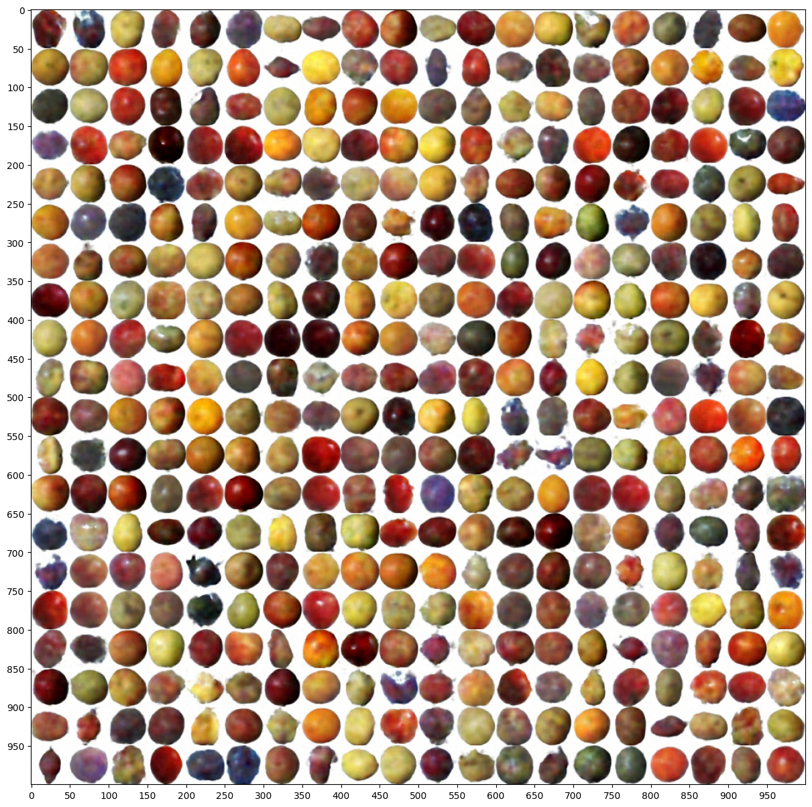

# Variational Autoencoders for Fruits 360 Dataset

This project implements two Variational Autoencoders (VAEs) for generating images using the Fruits 360 dataset. One VAE has a smaller latent space that can be visualized in 2D, and the other has a larger latent space for generating clearer and more detailed images.

## Table of Contents
- [Overview](#overview)
- [Features](#features)
- [Dataset](#dataset)
- [Model Architectures](#model-architectures)
  - [Small Latent Space VAE](#small-latent-space-vae)
  - [Larger Latent Space VAE](#larger-latent-space-vae)
- [Results](#results)


## Overview

Variational Autoencoders (VAEs) are generative models that learn the underlying structure of input data in a probabilistic manner. This project explores two VAEs trained on the Fruits 360 dataset:
1. **Small Latent Space VAE**: This model uses a 2-dimensional latent space, which allows for easy visualization of the learned latent variables.
2. **Larger Latent Space VAE**: This model uses an 8-dimensional latent space, enabling it to generate clearer and more detailed images.

## Features

- **Image Generation**: Generate images of fruits based on learned latent representations.
- **Latent Space Visualization**: Visualize the 2D latent space to understand how different fruit images are encoded.
- **Enhanced Image Quality**: Use a larger latent space for generating higher-quality images.

## Dataset

The project uses the Fruits 360 dataset which contains images of various fruits. Each image is resized to 50x50 pixels.

- **Total Images**: 55,238
- **Classes**: 131 different types of fruits and vegetables.

## Model Architectures

### Small Latent Space VAE

- **Latent Space Dimension**: 2
- **Encoder**: Convolutional layers followed by dense layers to encode the images into a 2D latent space.
- **Decoder**: Dense layers followed by transposed convolutional layers to reconstruct the images from the latent space.

```python
def create_encoder(latent_dim=2):
    encoder_inputs = keras.Input(shape=(50, 50, 3))
    x = keras.layers.Conv2D(32, (5, 5), activation='relu', padding='same')(encoder_inputs)
    x = keras.layers.Conv2D(32, (5, 5), strides=(2, 2), activation='relu')(x)
    x = keras.layers.Conv2D(32, (5, 5), activation='relu')(x)
    x = keras.layers.Conv2D(32, (5, 5), activation='relu')(x)
    x = keras.layers.Flatten()(x)
    x = keras.layers.Dense(128, activation='relu')(x)
    z_mean = layers.Dense(latent_dim, name="z_mean")(x)
    z_log_var = layers.Dense(latent_dim, name="z_log_var")(x)
    z = Sampling()([z_mean, z_log_var])
    encoder = keras.Model(encoder_inputs, [z_mean, z_log_var, z], name="encoder")
    return encoder
```

### Larger Latent Space VAE
- **Latent Space Dimension**: 8
- **Encoder**: Similar structure but encodes images into an 8-dimensional latent space.
- **Decoder**: Reconstructs images from the 8-dimensional latent space, allowing for more detailed image generation.

## Results

### Small Latent Space VAE
- **Visualization**: You can visualize the 2D latent space using a scatter plot to see how different fruit images are encoded.

### Larger Latent Space VAE
- **Enhanced Image Quality**: The images generated from the 8-dimensional latent space are clearer and more detailed compared to the 2D latent space.

### Example Generated Images
Here are some examples of images generated by the larger VAE:


### Latent Space Visualization
Here is the visualization of the latent space learned by the smaller VAE:


